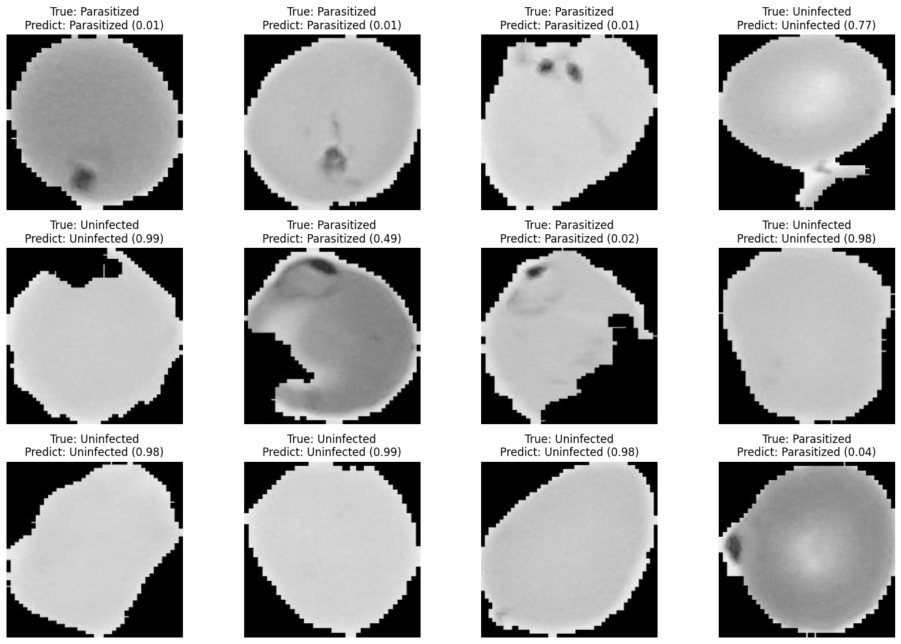
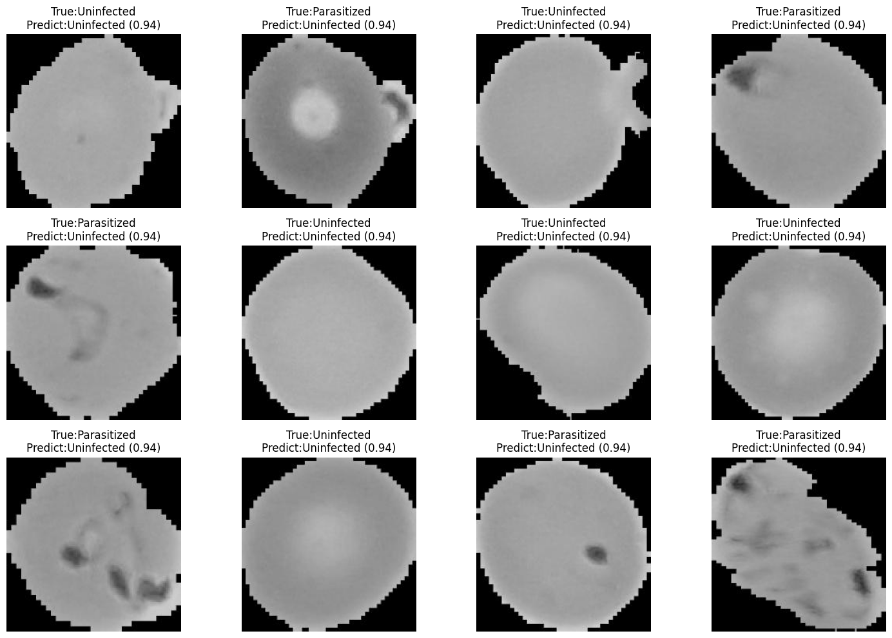

# Siaga Malaria Nusantara: Deteksi Dini Malaria Berbasis AI

Selamat datang di Siaga Malaria Nusantara! Proyek ini menghadirkan solusi cerdas untuk mendeteksi malaria secara dini menggunakan Convolutional Neural Network (CNN), yang terintegrasi dalam prototipe web telemedicine modern. Bayangkan sebuah alat yang membantu dokter dan tenaga medis di pelosok Nusantara untuk mendiagnosis malaria dengan cepat dan akurat.

## Pendahuluan

Malaria tetap menjadi momok di banyak wilayah tropis, termasuk Indonesia. Penyakit yang ditularkan oleh nyamuk ini membutuhkan deteksi cepat untuk menyelamatkan nyawa dan mencegah penyebaran lebih lanjut. Di sinilah Siaga Malaria Nusantara berperan: kami memanfaatkan kecerdasan buatan untuk menganalisis gambar mikroskopis sel darah dan menentukan apakah seseorang terinfeksi malaria.

Dengan dua pendekatan pemodelan: Custom CNN dan Transfer Learning berbasis EfficientNetB0. Kami membangun sistem yang tidak hanya akurat tetapi juga praktis untuk digunakan melalui aplikasi web interaktif.

## Struktur Folder

Proyek ini tersusun rapi dalam beberapa folder utama
- `data/`: Berisi referensi ke dataset malaria.
- `models`: Menyimpan model yang telah dilatih dalam berbagai format: SavedModel, Pickle, TFLite (standar dan kuantisasi), serta TFJS untuk kebutuhan web.
- `notebooks`: Koleksi Jupyter Notebook untuk analisis data, pelatihan model, dan evaluasi.
- `web_app`: Berisi referensi ke prototipe aplikasi web yang siap digunakan untuk prediksi malaria.

## EDA

Sebelum melangkah ke pemodelan, kami menggali dataset malaria untuk memahami karakteristiknya. Dataset ini berisi gambar sel darah dengan dua label: Parasitized (terinfeksi malaria) dan Uninfected (sehat).

Langkah-langkah EDA yang dilakukan:

- Pemeriksaan gambar corrupt: Seluruh gambar pada direktori train, valid, dan test diperiksa satu per satu untuk memastikan tidak ada file rusak atau tidak terbaca. Hasilnya, tidak ditemukan gambar corrupt.

- Distribusi kelas: Jumlah gambar di masing-masing kelas seimbang, baik untuk data train, valid, maupun test. Ini memastikan model tidak terdorong untuk memihak ke salah satu kelas.

- Visualisasi sampel gambar: Beberapa contoh gambar dari masing-masing kelas divisualisasikan untuk melihat perbedaan visual antara sel darah yang terinfeksi dan tidak terinfeksi.

- Ukuran gambar: Semua gambar memiliki ukuran yang sama yaitu 224x224 piksel, sehingga tidak diperlukan proses resize tambahan sebelum training.

- Pemeriksaan duplikasi gambar: Data train, valid, dan test diperiksa untuk memastikan tidak ada gambar yang identik secara konten (bukan hanya nama file). Hasilnya, tidak ditemukan gambar duplikat di ketiga subset tersebut.

EDA ini membantu kami memastikan kualitas data sebelum proses pemodelan dimulai, sehingga hasil pemodelan nantinya menjadi lebih akurat dan dapat diandalkan.

## Pemodelan

Kami mengembangkan dua model utama untuk tugas deteksi malaria. Berikut rinciannya

A. Struktur Direktori
- TRAIN_DIR = '/kaggle/input/malaria/Malaria Dataset/train'
- VALID_DIR = '/kaggle/input/malaria/Malaria Dataset/valid'
- TEST_DIR = '/kaggle/input/malaria/Malaria Dataset/test'

B. Parameter
- IMG_SIZE = (224, 224)
- BATCH_SIZE = 32
- EPOCHS_CNN = 50
- EPOCHS_EFFNET = 50

### Custom CNN

Model CNN kustom ini dirancang untuk mempelajari fitur dari awal (from scratch) berdasarkan dataset yang diberikan. Arsitekturnya terdiri dari tiga blok konvolusi yang bertujuan untuk mengekstraksi fitur dari gambar, diikuti oleh lapisan klasifikasi untuk menghasilkan prediksi biner.

Setiap blok konvolusi memiliki struktur sebagai berikut
- Lapisan Konvolusi: Menggunakan Conv2D dengan aktivasi ReLU untuk mengekstraksi fitur. Ukuran kernel diatur pada (3,3) dengan padding 'same' agar dimensi input tetap terjaga.
- Lapisan Pooling: Menggunakan MaxPooling2D dengan ukuran (2,2) untuk mengurangi dimensi spasial dan mempertahankan fitur penting.

Rincian setiap blok
- Blok 1: Lapisan Conv2D memiliki 32 filter, diikuti oleh MaxPooling2D.
- Blok 2: Lapisan Conv2D memiliki 64 filter, diikuti oleh MaxPooling2D.
- Blok 3: Lapisan Conv2D memiliki 128 filter, diikuti oleh MaxPooling2D.

Setelah proses konvolusi selesai, fitur yang dihasilkan diratakan (flattened) menjadi vektor satu dimensi. Vektor ini kemudian diproses melalui lapisan klasifikasi
- Lapisan Dense: Terdiri dari 128 unit dengan aktivasi ReLU untuk mempelajari kombinasi fitur yang lebih kompleks.
- Dropout: Diterapkan dengan tingkat 0.5 untuk mengurangi risiko overfitting dengan secara acak menonaktifkan sebagian neuron selama pelatihan.
- Lapisan Output: Lapisan Dense dengan 1 unit dan aktivasi sigmoid untuk menghasilkan probabilitas klasifikasi biner (terinfeksi malaria atau tidak).

Model ini dikompilasi dengan konfigurasi berikut
- Optimizer: Adam dengan learning rate 0.001, yang dipilih karena kemampuannya untuk menyesuaikan langkah pembelajaran secara adaptif.
- Loss: binary_crossentropy, sesuai untuk tugas klasifikasi biner.
- Metrics: accuracy, untuk mengukur performa model dalam mengklasifikasikan data.

Input untuk model ini adalah gambar grayscale dengan ukuran (224, 224, 1).

### Transfer Model (EfficientNetB0)

Model ini menggunakan pendekatan transfer learning dengan memanfaatkan EfficientNetB0, sebuah arsitektur yang telah dilatih sebelumnya pada dataset ImageNet. Pendekatan ini dipilih untuk memanfaatkan fitur yang telah dipelajari dari dataset besar, yang dapat meningkatkan performa pada dataset yang lebih kecil seperti dataset malaria ini.

Langkah-langkah pembangunan model
- Base Model: EfficientNetB0 dimuat dengan bobot pra-latih dari ImageNet. Semua lapisan pada base model diatur sebagai *trainable = False*, sehingga bobotnya tidak diperbarui selama pelatihan dan fitur yang telah dipelajari tetap dipertahankan.
- Pengolahan Output Base Model: Output dari EfficientNetB0 diproses melalui lapisan *GlobalAveragePooling2D*, yang mengurangi dimensi spasial menjadi vektor fitur dengan merata-ratakan nilai pada setiap saluran.
- Lapisan Tambahan
    - Dense: Lapisan fully connected dengan 512 unit dan aktivasi ReLU ditambahkan untuk mempelajari kombinasi fitur spesifik dari dataset malaria.
    - Dropout: Tingkat 0.5 diterapkan untuk mencegah overfitting.
    - Output: Lapisan Dense dengan 1 unit dan aktivasi sigmoid untuk klasifikasi biner.

Model ini dikompilasi dengan konfigurasi berikut
- Optimizer: Adam dengan learning rate 0.001.
- Loss: binary_crossentropy.
- Metrics: accuracy.

Input untuk model ini adalah gambar RGB dengan ukuran (224, 224, 3), sesuai dengan kebutuhan EfficientNetB0.

## Perbandingan Model

Setelah dilatih, kami menguji kedua model pada data test, hasilnya model yang dibangung secara custom menggunakan CNN murni jauh lebih unggul.

## Environment

### Library

- Python: >= 3.11
- os
- cv2 (opencv-python)
- random
- matplotlib.pyplot
- warnings
- numpy
- seaborn
- tensorflow
- pickle
- tensorflowjs
- ai-edge-litert
- sklearn.metrics

### Library Tambahan TensorFlow

- tensorflow.keras.models
- tensorflow.keras.layers
- tensorflow.keras.preprocessing.image
- tensorflow.keras.optimizers
- tensorflow.keras.applications
- tensorflow.keras.callbacks
- tensorflow.keras.utils

## Hasil

### Inferensi

A. Custom CNN

A. Transfer Model (EfficientNetB0)

### Prototipe

Prototipe web kami memungkinkan Anda mengunggah gambar sel darah dan mendapatkan prediksi instan. Dibangun dengan TensorFlow.js, semua proses berjalan di browser, aman dan cepat.

Coba sendiri di: [Web Telemedicine](https://siaga-malaria-nusantara.vercel.app/)

# Rencana ke Depan

- Perluas dataset dengan berbagai varian karena proyek ini hanya menggunakan gambar grayscale.
- Eksplorasi model lain untuk performa optimal.
